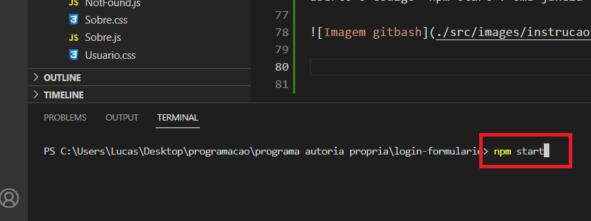

# Sobre o projeto

O projeto consistiu em criar um site de notícias do mercado financeiro. Quando a página é acessada, é realizado o consumo da API da Alpha Vantage para coletar as últimas notícias do mercado financeiro. Na seção "Top News", é carregado as 5 notícias mais relevantes e um gráfico (widget do tradinview) com o ticker relacionado a notícia principal do dia. No fim da página, foi adicionado a funcionalidade de pagination onde, o usuário pode carregar mais notícias. O menu de navegação fornece ao usuário a opção de procurar por um ticker em específico, um carrossel com efeito de parar quando o usuário passar o mouse por cima, funcionalidade de clicar na notícia e redirecionar para o site de origem e dropdown menus. 

## Acesse

<a href="https://ecommerce-santanafx.vercel.app/">Acesse a aplicação clicando aqui</a>.

## Imagens do projeto

## Linguagens utilizadas

JavaScript | React | HTML | CSS

 
  
  
  
  

## Como instalar

Para preparar o ambiente, precisaremos ter algumas coisas instaladas no computador, sendo elas:

Node.js
<a href="https://nodejs.org/pt-br">Clique aqui para instalar o Node.js</a>.

Para instalar o Node, clique no link e baixe a versão LTS (versão recomendada)
Para verificar se foi instalado corretamente, abra o terminal e escreva node -v ou node --version
alt text: site do Nodejs, com o botão da versão recomendada em foco por um quadrado vermelho!

Git
<a href="https://git-scm.com/download/windows">Clique aqui para instalar o Git</a>.

Caso não tenha um terminal de preferência, recomendo utilizar o git bash. Para instalá-lo, haverá uma opção durante a instalação do git para permitir instalar o git bash
alt text: imagem mostrando várias caixas selecionáveis. A caixa “Git Bash Here” está em evidência por um quadrado vermelho com uma seta apontada para ele

Para verificar se o git foi instalado corretamente, abra o terminal e escreva git --version
Visual Studio Code

Entre no link e baixe a versão de Windows.

<a href="https://code.visualstudio.com/download">Clique aqui para instalar o Visual Studio</a>.

Clique com o botão direito em algum local do computador e selecione a opção Git Bash Here.

Escreva no terminal o comando abaixo e no lugar de 'cole aqui' entre no projeto do GitHub e cole o link do projeto.

git clone 'cole aqui o link do projeto'

Uma pasta com o projeto desejado será adicionada a pasta em que foi escolhida.
Clique com o botão direito em cima da pasta e selecione "Abrir com Code"

Uma vez que o Visual studio estiver aberto com o projeto desejado, abra o terminal clicando no menu da aba superior e digite no terminal aberto o código "npm install" e logo em seguida digite "npm start". Uma janela do browser será aberta e o projeto será iniciado em seu computador.

